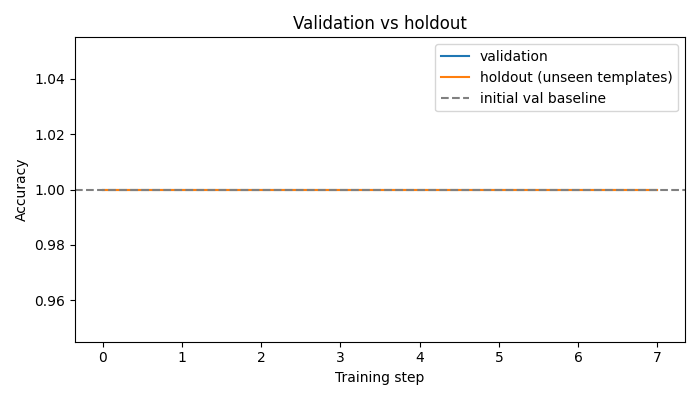
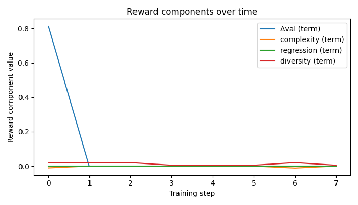

# Forge: Self-Improving Playbook Environment

Forge is an **OpenEnv** environment for training an agent to improve its own playbook: prompts, lessons, routing rules, and tools.

The agent sees failures, proposes structured playbook edits, tests them inside the environment, and only keeps edits that improve validation reward without breaking regression checks.

## Submission Links

Fill these before final submission:

- **Hugging Face Space:** TODO: add Space URL after pushing, for example `https://huggingface.co/spaces/YOUR_NAME/forge-openenv`
- **Colab / experiment notebook:** TODO: add Colab share URL. Local steps are in [`docs/REAL_LLM_AND_COLAB.md`](docs/REAL_LLM_AND_COLAB.md)
- **Mini-blog or video:** TODO: add Hugging Face blog or YouTube URL
- **GitHub repo:** https://github.com/vamsi805/META-RL

## Why This Environment Is Interesting

Most agent demos show a fixed prompt and fixed tools. Forge tests a harder behavior: can an agent learn from task failures and improve the operating manual it uses next time?

The environment is challenging because an edit must satisfy several goals at once:

- improve validation task performance
- avoid making the playbook too large
- avoid breaking earlier tasks
- generalize to holdout tasks with different wording
- keep learned tools sandbox-safe

## What the Agent Sees and Does

At each training step:

1. Forge loads the current playbook.
2. The editor proposes candidate edits such as prompt changes, new lessons, or safe tool templates.
3. The executor uses the playbook to solve tasks.
4. The environment grades the behavior.
5. Forge accepts the best edit only if reward is positive.
6. Metrics and playbook checkpoints are written to `outputs/`.

In real model mode, Qwen can be used for:

- writing candidate playbook edits
- running the executor agent loop
- optionally judging written responses

## Quickstart

```bash
python -m venv .venv && source .venv/bin/activate
pip install -e ".[dev]"
export FORGE_TOOL_ISOLATION=subprocess   # or `auto` if Docker is available
pytest -q
python training/train_forge.py --smoke
python outputs/plots/generate_plots.py
python demo/app.py
```

## Real model mode

Default mode is `stub`, which avoids downloading a model. To use Qwen through local Transformers:

```bash
pip install -e ".[train,dev]"
export FORGE_LLM_BACKEND=transformers
export FORGE_LLM_MODEL=Qwen/Qwen2.5-1.5B-Instruct
export FORGE_TOOL_ISOLATION=subprocess
python training/train_forge.py --llm_backend transformers --model_name "$FORGE_LLM_MODEL" --max_steps 3
```

For Colab T4, Hugging Face credits, and push steps, see **[docs/REAL_LLM_AND_COLAB.md](docs/REAL_LLM_AND_COLAB.md)**.

For the full submission checklist, see **[docs/SUBMISSION_RUNBOOK.md](docs/SUBMISSION_RUNBOOK.md)**.

## Results

The repo includes a short local run so the demo has artifacts to show. For final judging, replace these with plots from your real Colab run.

| Plot | What it shows |
| --- | --- |
| `outputs/plots/01_val_accuracy.png` | Validation and holdout accuracy over training steps. |
| `outputs/plots/02_holdout_generalisation.png` | Generalization on unseen template family tasks. |
| `outputs/plots/03_reward_components_stacked.png` | Reward terms: validation gain, complexity, regression, diversity. |
| `outputs/plots/07_baseline_vs_trained.png` | Baseline score vs trained trajectory. |
| `outputs/plots/08_training_loss_proxy.png` | Selection-loss proxy for the playbook edit loop. |





## Architecture overview

| Piece | Role |
|--------|------|
| `forge_env/server/forge_environment.py` | OpenEnv `Environment`: `reset` / `step` / `state`, curriculum-aware eval, `preview_propose` for GRPO groups |
| `forge_env/server/executor.py` | Bounded multi-step rollout; real model mode can call tools and feed tool results back to the model |
| `forge_env/server/llm.py` | Real model client: local Transformers or Hugging Face hosted inference |
| `forge_env/server/tool_runtime.py` | Tool execution bridge for the real executor loop |
| `forge_env/server/edit_ops.py` | Apply structured edits; `add_tool` runs AST + smoke test + optional Docker isolation |
| `forge_env/server/tasks/` | T1 programmatic, T2 rubric (ensemble heuristics), T3 hidden-goals; **alpha** vs **beta** template families |
| `forge_env/server/curriculum.py` | Warm-up (T1) → diversification (+T2) → full (+T3) by global step |
| `forge_env/server/sandbox/` | Tool execution: Docker (`network=none`, `read-only`, default seccomp) or subprocess fallback |
| `training/train_forge.py` | GRPO-style loop: sample K edits, `preview_propose` each, group-relative advantages, commit best if positive |
| `outputs/plots/generate_plots.py` | PRD-style figures from `outputs/smoke_metrics.jsonl` |
| `demo/app.py` | Gradio: evolution summary, manifest viewer, prompt diff, metrics replay |

Full **call-level flow** (what file calls what, and when): see **[docs/ARCHITECTURE_AND_FLOW.md](docs/ARCHITECTURE_AND_FLOW.md)**.

## Hugging Face Space

The root `app.py` launches the Gradio demo, so a Gradio Space can run:

```bash
python app.py
```

The root `requirements.txt` installs this package plus demo dependencies.

## OpenEnv server

```bash
uvicorn forge_env.server.app:app --host 0.0.0.0 --port 8000
```

The app is built with `openenv.core.env_server.create_fastapi_app`. Remote clients: `ForgeEnvClient` in `forge_env/client.py`.

## Docker

**Server** (isolates the env process from the host):

```bash
docker build -f forge_env/server/Dockerfile -t forge-env .
docker run --rm -p 8000:8000 --read-only --tmpfs /tmp:rw,size=64m forge-env
```

**Tool runs** (when `FORGE_TOOL_ISOLATION=auto` or `docker`): see README section in earlier commits — tools run in a throwaway container with `--network none`, read-only root, tmpfs `/tmp`, and Docker’s default seccomp profile.

## Submission checklist (hackathon-oriented)

- [x] OpenEnv base classes + `create_fastapi_app`
- [x] Training script + metrics JSONL + plots
- [x] Colab/Hugging Face guide in `docs/REAL_LLM_AND_COLAB.md`
- [x] Gradio Space entrypoint in root `app.py`
- [ ] Host on Hugging Face Space and add the URL above
- [ ] Run a real Qwen experiment in Colab and replace sample plots
- [ ] Add mini-blog or video URL above

## License

BSD-style (match OpenEnv / team choice).
