# Forge architecture and code flow

This file explains the project in simple English.

Use it like a reading guide. Start at the top, then open the file and function names as they appear. The goal is that you can follow the code in the same order that the program runs.

## 1. What this project does

Forge trains a small "playbook" to get better at tasks.

A playbook is just a set of:

- prompts
- lessons
- routing rules
- tool names
- learned tool code

The training code tries a few possible edits to the playbook. It scores each edit. If an edit improves the score, Forge saves that edit as a new playbook version.

So the simple idea is:

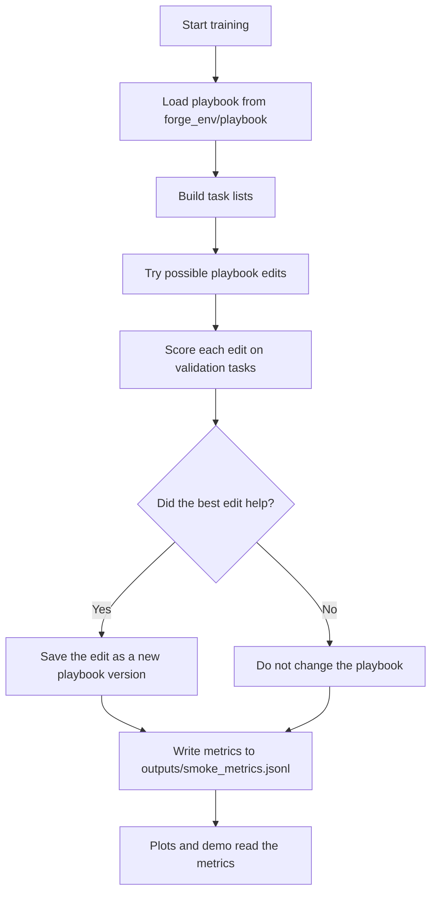

Important word meanings:

- "Playbook" means the current prompts, lessons, routing rules, and tools.
- "Task" means one problem that the playbook is tested on.
- "Validation task" means a task used to decide if an edit is good.
- "Holdout task" means a task saved for a more honest check. It is not used to choose edits.
- "Reward" means the final number that says whether an edit was good or bad.
- "Commit" means Forge accepts an edit and saves a new playbook version.
- "Candidate" means one possible edit before it is accepted.
- "Curriculum" means Forge starts with easier tasks, then adds harder tasks later.
- "Regression check" means Forge checks if a new edit broke tasks that used to work.
- "Trajectory" means the list of small internal steps taken while answering a task.
- "Stub" means the simple local fallback used when real model mode is off.
- `LLM` appears in a few file names and setting names. It means "large language model". In this doc, you can read it as "real model".
- `Dict`, `List`, and `Tuple` are Python type hints. They mean dictionary, list, and pair or group of values.
- `T1`, `T2`, and `T3` are code names for task levels. `T1` is easiest. `T3` is hardest.

## 2. The most important files

Read these files first:

| File | What it does |
| --- | --- |
| `training/train_forge.py` | Starts training. This is the best first file to read. |
| `forge_env/server/forge_environment.py` | Main environment. It loads the playbook, scores edits, accepts edits, and returns results. |
| `forge_env/server/playbook.py` | Defines the `Playbook` object and loads files from `forge_env/playbook/`. |
| `forge_env/server/tasks/splits.py` | Creates train, validation, and holdout task lists. |
| `forge_env/server/executor.py` | Runs a task using the current playbook and returns an answer. |
| `forge_env/server/llm.py` | Creates the real model client for local Hugging Face models or Hugging Face API calls. |
| `forge_env/server/tool_runtime.py` | Runs built-in and learned tools for the real executor loop. |
| `forge_env/server/edit_ops.py` | Applies an edit to a playbook. |
| `forge_env/server/rewards/compose.py` | Combines score changes and penalties into one reward number. |
| `forge_env/server/sandbox/` | Runs learned tool code in a safer place. |
| `training/editor_policy.py` | Creates playbook edit candidates. It can use templates or a real model. |
| `demo/app.py` | Shows metrics and playbook versions in the demo. |
| `docs/REAL_LLM_AND_COLAB.md` | Step-by-step guide for real Qwen runs on Colab and Hugging Face. |
| `notebooks/forge_qwen_colab_steps.py` | Colab-style cells saved as a Python notebook script. |

## 3. Main training flow

This is the main flow when you run:

```bash
python training/train_forge.py --smoke
```

That command uses `stub` mode by default. `stub` mode is fast and does not download a model.

For a real Qwen model run, use:

```bash
python training/train_forge.py \
  --llm_backend transformers \
  --model_name Qwen/Qwen2.5-1.5B-Instruct \
  --max_steps 3
```

Diagram:

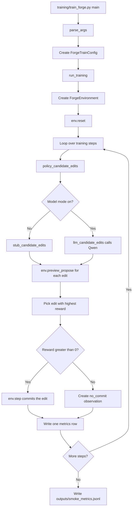

### Step 1: Python starts `training/train_forge.py`

Open `training/train_forge.py`.

At the bottom of the file, this code runs:

```python
if __name__ == "__main__":
    args = parse_args()
    cfg = ForgeTrainConfig(
        model_name=args.model_name,
        max_steps=args.max_steps,
        llm_backend=args.llm_backend,
    )
    path = run_training(cfg, smoke=args.smoke)
    print(f"Wrote metrics to {path}")
```

This does four things:

1. `parse_args()` reads command line flags like `--smoke`, `--llm_backend`, and `--model_name`.
2. `ForgeTrainConfig(...)` creates training settings.
3. `run_training(...)` starts the real training loop.
4. It prints where the metrics file was written.

### Step 2: `run_training` creates the environment

Still in `training/train_forge.py`, read `run_training`.

The first important line is:

```python
env = ForgeEnvironment()
```

This jumps into `forge_env/server/forge_environment.py`.

`ForgeEnvironment` is the main class for the project. It owns:

- the current playbook
- the task lists
- the current score
- the step count
- the executor that answers tasks
- the logic for accepting or rejecting edits

## 4. What happens inside `ForgeEnvironment()`

Open `forge_env/server/forge_environment.py`.

The class starts here:

```python
class ForgeEnvironment(Environment[ForgeAction, ForgeObservation, ForgeState]):
```

That means `ForgeEnvironment` follows the OpenEnv environment shape. The important methods are:

- `__init__`
- `reset`
- `preview_propose`
- `step`
- `state`

### Step 1: `__init__` loads the starting data

When `ForgeEnvironment()` is called, Python runs:

```python
def __init__(self) -> None:
```

The order is:

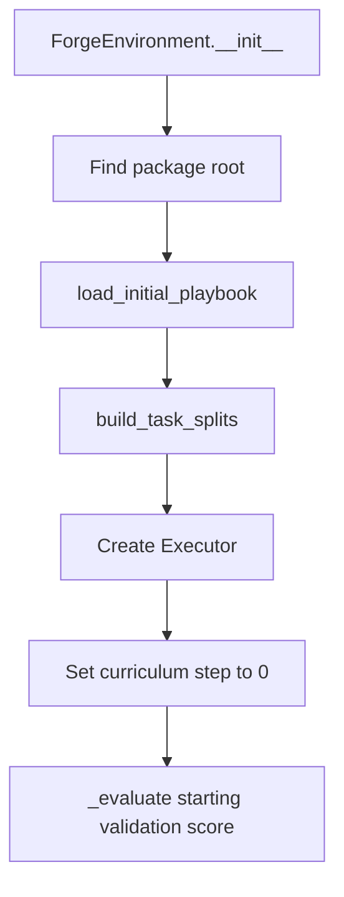

What each line means:

1. `package_root = Path(__file__).resolve().parents[1]`
   - Finds the `forge_env` folder.
   - The playbook lives inside this folder.

2. `self.playbook = load_initial_playbook(package_root)`
   - Calls `load_initial_playbook` in `forge_env/server/playbook.py`.
   - This reads the starting prompts and lessons from disk.

3. `self.splits = build_task_splits(base_seed=42)`
   - Calls `build_task_splits` in `forge_env/server/tasks/splits.py`.
   - This creates the task lists used during training.

4. `self.executor = Executor()`
   - Creates the object that answers tasks.
   - The executor is in `forge_env/server/executor.py`.
   - Inside `Executor.__init__`, the code checks `FORGE_LLM_BACKEND`.
   - If model mode is off, the executor uses the local fallback.
   - If model mode is on, the executor creates a real model client from `forge_env/server/llm.py`.

5. `self._curriculum_step = 0`
   - Starts at training step 0.
   - At step 0, only the easiest tasks are active.

6. `self.val_baseline = self._evaluate(self.playbook, self.splits["val"])`
   - Scores the starting playbook.
   - This is the score that future edits must beat.

## 5. How the playbook loads

Open `forge_env/server/playbook.py`.

The main object is:

```python
@dataclass
class Playbook:
```

It stores:

- `root`: where the playbook files live
- `version`: current playbook version number
- `parent`: previous version number
- `prompts`: prompt text loaded from markdown files
- `lessons`: lesson text loaded from markdown files
- `routing`: which prompts to use for each task type
- `tools_registry`: built-in tool list
- `learned_tools`: tool code added during training
- `edit_log`: history of edits

The loader is:

```python
def load_initial_playbook(root: Path) -> Playbook:
```

Its flow:

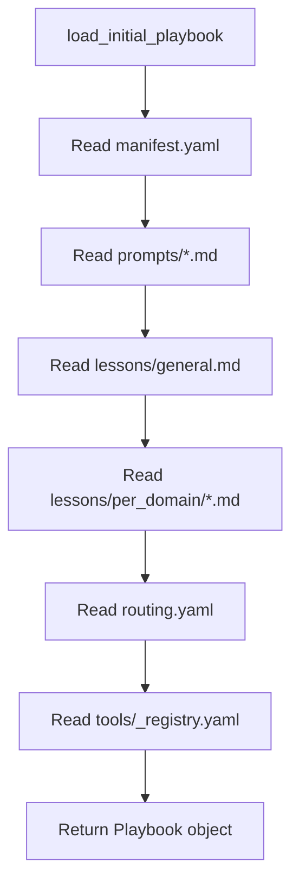

Important lines:

1. `playbook_dir = root / "playbook"`
   - Points to `forge_env/playbook`.

2. `manifest = yaml.safe_load(...)`
   - Reads `forge_env/playbook/manifest.yaml`.
   - This gives the starting version number.

3. `prompts = {... for p in prompts_dir.glob("*.md")}`
   - Reads every markdown file in `forge_env/playbook/prompts/`.
   - The file name becomes the prompt name.
   - Example: `reflector.md` becomes `prompts["reflector"]`.

4. `lessons = {"general": ...}`
   - Reads the general lesson file.

5. The `per_domain` loop reads lessons for a domain.
   - Example: `lessons/per_domain/scheduling.md` becomes `lessons["per_domain/scheduling"]`.

6. `routing = yaml.safe_load(...)`
   - Reads `forge_env/playbook/routing.yaml`.
   - This tells the executor which prompts matter for each kind of task.

7. `tools_registry = yaml.safe_load(...)`
   - Reads the built-in tool list.

8. The function returns a `Playbook`.
   - The environment stores it as `self.playbook`.

## 6. How tasks are created

Open `forge_env/server/tasks/splits.py`.

The main function is:

```python
def build_task_splits(base_seed: int = 42) -> Dict[str, List[dict]]:
```

It returns three lists:

- `train`: tasks used to find failures and check if old behavior broke
- `val`: validation tasks used to score possible edits
- `holdout`: hidden-style tasks used only for reporting

Flow:

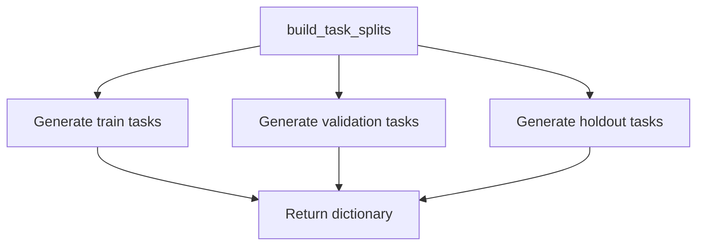

Task levels:

- `T1` means simple program-like tasks.
- `T2` means tasks scored by a rubric.
- `T3` means user-like tasks with hidden needs.

The code uses two families:

- `alpha` tasks are used for train and validation.
- `beta` tasks are used for holdout.

This matters because holdout tasks use different wording. If holdout score goes up, it is a better sign that the playbook learned something useful.

## 7. How the curriculum works

Open `forge_env/server/curriculum.py`.

The main function is:

```python
def active_tiers_for_step(step: int) -> set[str]:
```

It decides which task levels are active:

| Step range | Active task levels | Phase name |
| --- | --- | --- |
| step less than 80 | `T1` | `warmup` |
| step 80 to 249 | `T1`, `T2` | `diversification` |
| step 250 or more | `T1`, `T2`, `T3` | `full` |

The environment uses this in:

```python
def _active_tiers(self) -> set[str]:
```

and:

```python
def _filter_tasks(self, tasks: List[Dict[str, Any]]) -> List[Dict[str, Any]]:
```

So when training is early, validation only checks easier tasks. Later, it checks more task types.

## 8. What `env.reset` does

Back in `forge_env/server/forge_environment.py`, read:

```python
def reset(...)
```

Training calls it here:

```python
env.reset(training_step=0)
```

Flow:

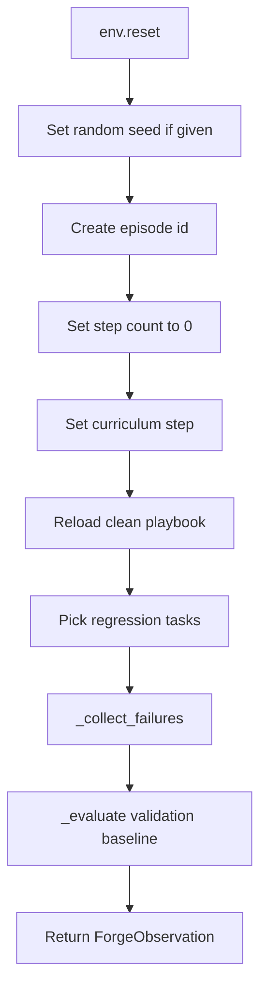

What it means:

1. It starts a fresh episode.
2. It reloads the original playbook from disk.
3. It picks a fixed set of train tasks for regression checks.
4. It collects a few failing tasks.
5. It computes the current validation score.
6. It returns a `ForgeObservation`.

`ForgeObservation` is defined in `forge_env/models.py`.

Important fields:

- `phase`: what just happened
- `playbook_snapshot`: current playbook data
- `failures_buffer`: examples the current playbook failed
- `val_baseline`: current validation score
- `reward`: reward for the last action
- `metadata`: extra info such as curriculum phase

## 9. The training loop in detail

Go back to `training/train_forge.py`.

Inside `run_training`, this is the main loop:

```python
for step in range(total_steps):
```

Each loop step does the same pattern.

### Step 1: Set the curriculum

```python
env.set_curriculum_step(step)
```

This updates the environment so it knows which task levels are active at this training step.

### Step 2: Create possible edits

```python
candidates = policy_candidate_edits(step, k, env, cfg)
```

Open:

```python
def policy_candidate_edits(step: int, k: int, env: ForgeEnvironment, cfg: ForgeTrainConfig):
```

This function returns a few edit dictionaries.

Examples of edit types:

- `edit_prompt`: replace a prompt file in the playbook
- `write_lesson`: add lesson text to the playbook
- `add_tool`: add a tool from a safe template
- `no_op`: make no change

In `stub` mode, this function calls:

```python
stub_candidate_edits(step, k)
```

That function is in `training/editor_policy.py`.

It creates edits from local templates.

In real model mode, this function calls:

```python
llm_candidate_edits(...)
```

That function is also in `training/editor_policy.py`.

It sends these things to the model:

- current training step
- current validation score
- current playbook snapshot
- recent failures
- allowed edit types

The model returns JSON candidate edits.

The expected model shape is:

```json
{
  "candidates": [
    {
      "diagnosis": "Why this edit may help.",
      "action": {
        "type": "write_lesson",
        "target": "lessons/general.md",
        "content": "Lesson text",
        "rationale": "Reason"
      }
    }
  ]
}
```

The code validates those edits before scoring them.

Before an edit is returned, it goes through:

```python
validate_action_shape(...)
```

That function is in `forge_env/server/editor_schema.py`.

It checks that the edit has the expected shape. If the edit is malformed, the code turns it into a safe `no_op` edit.

### Step 3: Score every edit without saving it

```python
previews = [env.preview_propose(c) for c in candidates]
```

This calls `preview_propose` once for each possible edit.

Important: `preview_propose` does not save the edit. It only tests the edit and returns a score.

Diagram:

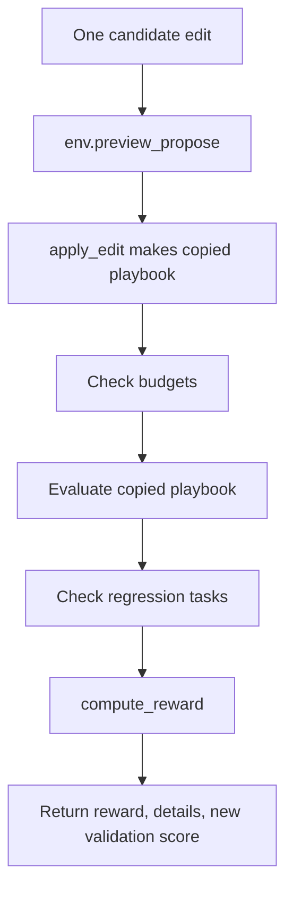

## 10. What `preview_propose` does

Open `forge_env/server/forge_environment.py`.

Read:

```python
def preview_propose(self, edit: Dict[str, Any]) -> Tuple[float, Dict[str, float], float]:
```

Simple meaning:

It asks, "If we made this edit, would the playbook get better?"

Detailed flow:

1. `old = self.playbook`
   - Store the current accepted playbook.

2. `candidate = apply_edit(old, edit)`
   - Make a changed copy of the playbook.
   - This does not replace `self.playbook`.

3. If the edit adds a tool and the tool is unsafe, `apply_edit` raises `ToolValidationError`.
   - `preview_propose` returns reward `-0.2`.
   - The playbook is not changed.

4. `violates_budget(candidate)`
   - Checks if the candidate playbook is too large or has too many tools.
   - If yes, reward is `-1.0`.

5. `return self._score_candidate(old, candidate, edit)`
   - Scores the candidate playbook.

## 11. How an edit is applied

Open `forge_env/server/edit_ops.py`.

The main function is:

```python
def apply_edit(playbook: Playbook, action: Dict[str, Any]) -> Playbook:
```

Flow:

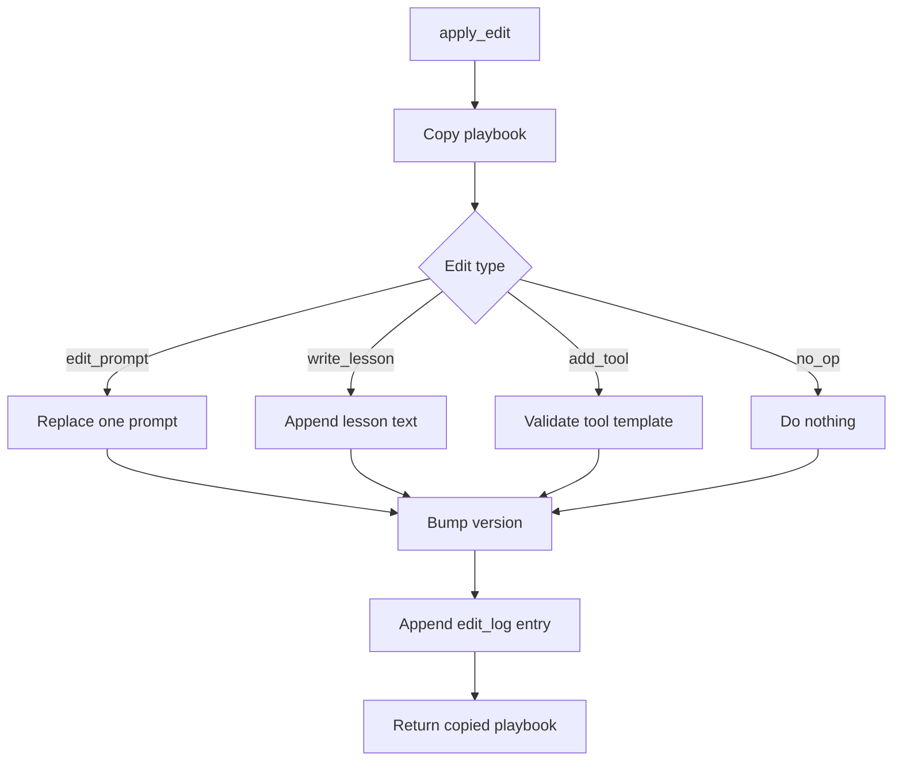

What each edit type does:

### `edit_prompt`

Code path:

```python
if action_type == "edit_prompt":
```

It reads `target`, for example:

```text
prompts/reflector.md
```

Then it converts that into the prompt name:

```text
reflector
```

Then it replaces:

```python
pb.prompts[name] = new_content
```

### `write_lesson`

Code path:

```python
elif action_type == "write_lesson":
```

It chooses where to write the lesson:

- `lessons/general.md` becomes `lessons["general"]`
- `lessons/per_domain/scheduling.md` becomes `lessons["per_domain/scheduling"]`

Then it appends the new text to the old lesson text.

### `add_tool`

Code path:

```python
elif action_type == "add_tool":
```

The edit does not accept random tool code from anywhere. It picks a known template from:

```python
TOOL_TEMPLATES
```

Then it calls:

```python
_validate_template_tool(template_name, template)
```

That validation checks the code before adding it.

### `no_op`

Code path:

```python
elif action_type == "no_op":
    pass
```

This edit does nothing.

### Version update

At the end of `apply_edit`, this always happens:

```python
pb.parent = playbook.version
pb.version = playbook.version + 1
pb.edit_log.append(...)
```

So the copied playbook records:

- which version it came from
- its new version number
- what edit was made

## 12. How tool safety works

Tool safety starts inside `apply_edit` when the edit type is `add_tool`.

Flow:

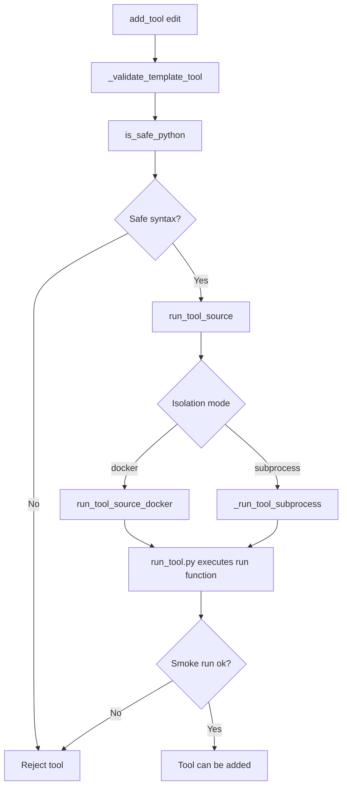

Files to read in order:

1. `forge_env/server/edit_ops.py`
   - `_validate_template_tool`

2. `forge_env/server/sandbox/ast_check.py`
   - `is_safe_python`
   - Checks the Python syntax tree and rejects dangerous code patterns.

3. `forge_env/server/sandbox/subprocess_runner.py`
   - `run_tool_source`
   - Chooses Docker mode or subprocess mode.

4. `forge_env/server/sandbox/docker_runner.py`
   - `run_tool_source_docker`
   - Runs the tool inside Docker with network off and a read-only workspace.

5. `forge_env/server/sandbox/run_tool.py`
   - Runs the tool's `run(...)` function with test inputs.

Simple meaning:

Forge does not add a learned tool just because an edit asks for it. The tool must pass a code safety check and a small test run first.

### Runtime tool calls from the real executor

The section above is about validating a new learned tool before adding it.

There is another tool path during real task answering.

Open:

```text
forge_env/server/tool_runtime.py
```

The main class is:

```python
class ToolRuntime:
```

Flow:

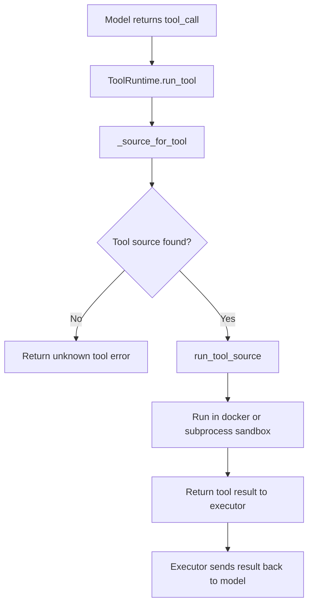

Important functions:

### `available_tools`

Read:

```python
def available_tools(self, playbook: Playbook, task_type: str) -> list[dict[str, Any]]:
```

This tells the model which tools it can call for the current task.

It reads:

- built-in tools from `playbook.tools_registry`
- routing rules from `playbook.routing`
- learned tools from `playbook.learned_tools`

### `run_tool`

Read:

```python
def run_tool(self, playbook: Playbook, name: str, args: Dict[str, Any]) -> ToolRunResult:
```

This finds the tool source code and runs it through:

```python
run_tool_source(...)
```

So the executor does not directly call tool Python functions. It uses the sandbox runner.

## 13. How scoring works

Scoring starts from `preview_propose` or `step`.

Both call:

```python
self._score_candidate(old_playbook, candidate, edit)
```

Open `forge_env/server/forge_environment.py` and read:

```python
def _score_candidate(...)
```

Flow:

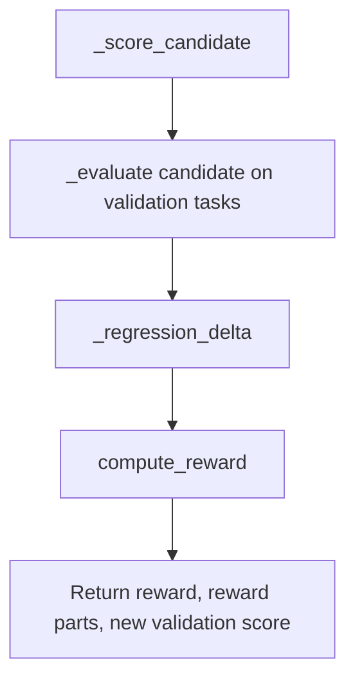

### `_evaluate`

Read:

```python
def _evaluate(self, playbook: Playbook, tasks: List[Dict[str, Any]]) -> float:
```

Flow:

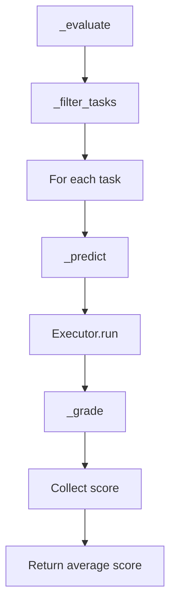

What happens:

1. `_filter_tasks` removes task levels that are not active yet.
2. `_predict` asks the executor to answer the task.
3. `_grade` scores the answer.
4. `_evaluate` returns the average score.

### `_predict`

Read:

```python
def _predict(self, task: Dict[str, Any], playbook: Playbook) -> Dict[str, Any]:
```

It calls:

```python
pred, _traj = self.executor.run(task, playbook)
```

`pred` is the answer.

`_traj` is the path taken by the executor. The underscore means the environment ignores it here.

### `_grade`

Read:

```python
def _grade(self, task: Dict[str, Any], prediction: Dict[str, Any]) -> float:
```

It chooses the grader by task level:

- `T1` uses `grade_tier1`
- `T2` uses `grade_tier2_ensemble`
- `T3` uses `grade_tier3`

Each grader returns a number. Higher is better.

### Optional model judge for `T2`

Open:

```text
forge_env/server/tasks/tier2_rubric.py
```

By default, `grade_tier2_ensemble` uses three local text checks. This is fast.

If you set:

```bash
export FORGE_LLM_JUDGE=1
```

then `grade_tier2_ensemble` uses:

```python
LLMRubricJudge().score(response, rubric)
```

Flow:

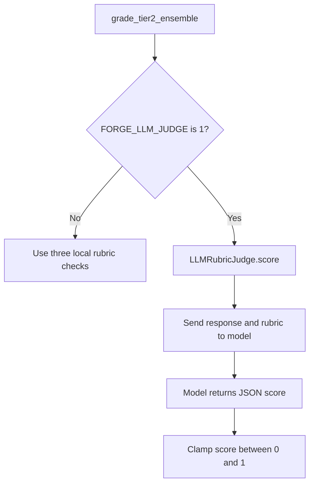

Keep this off for quick runs. Turn it on when you want the written task grading to also use the model.

### `_regression_delta`

Read:

```python
def _regression_delta(self, old_pb: Playbook, candidate_pb: Playbook) -> int:
```

This checks if the new playbook broke old tasks.

It does:

1. Count failures for the old playbook.
2. Count failures for the candidate playbook.
3. Return only the extra failures caused by the candidate.

If the candidate broke more tasks, the reward gets a penalty.

## 14. How reward is computed

Open `forge_env/server/rewards/compose.py`.

The main function is:

```python
def compute_reward(...)
```

Flow:

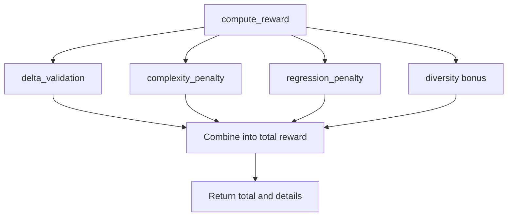

Reward parts:

- `delta_val`: how much validation score improved
- `complexity`: penalty if the playbook became too large
- `regression`: penalty if old tasks got worse
- `diversity`: small bonus for not repeating the same edit type too often
- `total`: final reward

Simple rule:

If `total` is greater than 0, the edit can be accepted.

If `total` is 0 or less, the edit is not accepted during training.

## 15. How real model clients are created

Open `forge_env/server/llm.py`.

This file hides the model setup behind one simple function:

```python
get_configured_llm_client(...)
```

Flow:

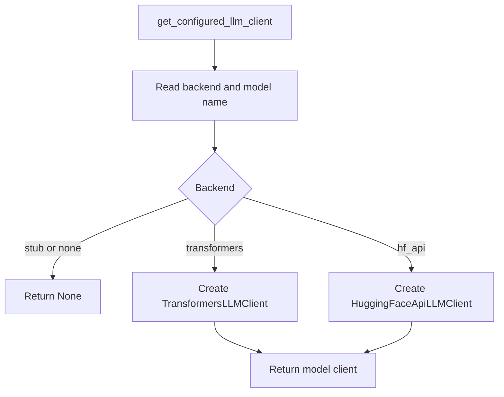

The backend comes from either command line settings or environment variables.

Important settings:

| Setting | Meaning |
| --- | --- |
| `FORGE_LLM_BACKEND=stub` | No model. Use local fallback code. |
| `FORGE_LLM_BACKEND=transformers` | Load a Hugging Face model in this Python process. This is the Colab T4 path. |
| `FORGE_LLM_BACKEND=hf_api` | Call Hugging Face hosted inference using your token. |
| `FORGE_LLM_MODEL=Qwen/Qwen2.5-1.5B-Instruct` | The model name to use. |
| `FORGE_LLM_LOAD_IN_4BIT=1` | Load bigger models with less memory when using `transformers`. |
| `HF_TOKEN=...` | Hugging Face token for API calls or gated models. |

### `TransformersLLMClient`

This class loads the model locally with:

```python
AutoTokenizer.from_pretrained(...)
AutoModelForCausalLM.from_pretrained(...)
```

When code calls:

```python
client.generate(messages, ...)
```

it:

1. formats the chat messages
2. tokenizes them
3. calls `model.generate`
4. decodes the new tokens into text
5. returns the text

### `HuggingFaceApiLLMClient`

This class uses:

```python
InferenceClient(...)
```

When code calls:

```python
client.generate(messages, ...)
```

it sends the messages to Hugging Face hosted inference and returns the reply text.

### `extract_json_object`

Model replies are not always clean. Sometimes the model returns extra text or markdown.

This helper tries to pull one JSON object from the model reply.

It is used by:

- the real executor loop in `forge_env/server/executor.py`
- the real editor policy in `training/editor_policy.py`
- the optional model judge in `forge_env/server/tasks/tier2_rubric.py`

## 16. How the executor answers a task

Open `forge_env/server/executor.py`.

The main class is:

```python
class Executor:
```

The main function is:

```python
def run(self, task: Dict[str, Any], playbook: Playbook) -> Tuple[Dict[str, Any], List[dict]]:
```

Flow:

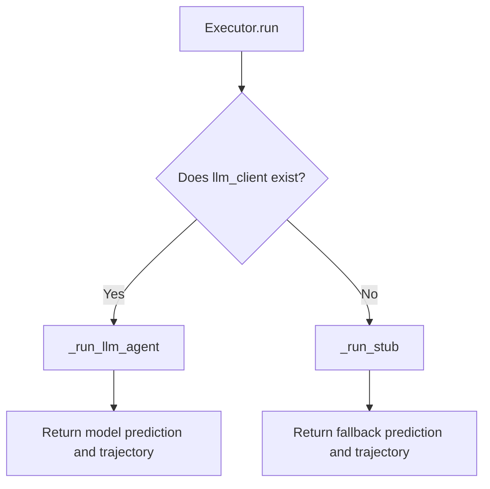

Important:

If real model mode is off, `self.llm_client` is `None`. The executor uses `_run_stub`.

If real model mode is on, `self.llm_client` is a real model client. `Executor.run` calls `_run_llm_agent`.

### Real model path: `_run_llm_agent`

Read:

```python
def _run_llm_agent(...)
```

This is the real agent loop.

Flow:

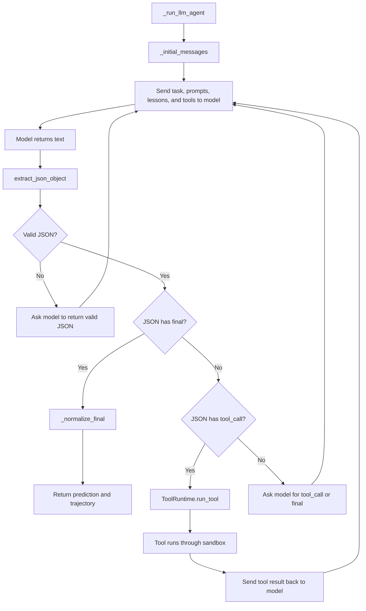

The model is told to return only JSON.

For a tool call, the model should return:

```json
{
  "thought": "I need calendar data.",
  "tool_call": {
    "name": "search_calendar",
    "args": {
      "participants": ["Asha", "Ben"],
      "duration_minutes": 30
    }
  }
}
```

For a final answer, the model should return:

```json
{
  "thought": "I have enough information.",
  "final": {
    "text": "Here is the final answer."
  }
}
```

For `T1` tasks, the final answer should look like:

```json
{
  "thought": "I found the best slot.",
  "final": {
    "slot": "Wednesday 13:00",
    "duration": "30"
  }
}
```

### `_initial_messages`

Read:

```python
def _initial_messages(...)
```

This builds the first model input.

It includes:

- the task
- the prompt text selected by routing
- all lesson text
- available tools for this task type
- the final answer shape the model should use

The available tools come from:

```python
self.tool_runtime.available_tools(playbook, task_type)
```

### `_normalize_final`

Read:

```python
def _normalize_final(...)
```

This makes the final model answer match what the graders expect.

For `T1`, it returns a dictionary with:

- `slot`
- `duration`

For `T2` and `T3`, it returns a dictionary with:

- `text`

### Fallback path: `_run_stub`

Read:

```python
def _run_stub(...)
```

This path is used when model mode is off.

It does not call Qwen. It uses the old local logic below.

### `_finalize_t1`

Read:

```python
def _finalize_t1(...)
```

What it does:

1. It waits until internal step 2.
2. It reads all playbook lessons.
3. If lessons contain words like `earliest` and `slot`, it returns the expected answer.
4. Otherwise, it returns a weaker default answer.

This means a lesson edit can improve `T1` task score.

### `_finalize_t2`

Read:

```python
def _finalize_t2(...)
```

What it does:

1. It waits until internal step 2.
2. It calls `_routing_blob`.
3. `_routing_blob` collects the prompts and lessons for the task type.
4. If the text contains useful words like `constraint` or `re-read`, it returns a stronger email-style answer.
5. Otherwise, it returns a shorter answer.

This means prompt and lesson edits can improve `T2` task score.

### `_finalize_t3`

Read:

```python
def _finalize_t3(...)
```

What it does:

1. It waits until internal step 3.
2. It checks hidden cues in the task.
3. It returns a recommendation that tries to include those cues.

This is used for more user-like tasks.

### `_routing_blob`

Read:

```python
def _routing_blob(self, playbook: Playbook, task: Dict[str, Any]) -> str:
```

What it does:

1. Reads the task type, such as `scheduling`, `email`, or `shopping`.
2. Looks up that task type in `playbook.routing`.
3. Finds which prompts should be used.
4. Joins those prompts with all lessons.
5. Returns one lowercase text string.

The executor uses this text to decide if the playbook has useful guidance.

## 17. How an edit is accepted

Back in `training/train_forge.py`, after previews:

```python
best_i = max(range(len(rewards)), key=lambda i: rewards[i])
best_reward = rewards[best_i]
```

This chooses the candidate edit with the highest reward.

Then:

```python
if best_reward > 0:
    obs = env.step(...)
else:
    obs = ForgeObservation(phase="no_commit", ...)
```

If reward is not positive, the playbook stays the same.

If reward is positive, training calls:

```python
env.step(ForgeAction(type="propose_edit", edit=candidates[best_i]), training_step=step)
```

## 18. What `env.step` does

Open `forge_env/server/forge_environment.py`.

Read:

```python
def step(self, action: ForgeAction, ...)
```

Flow:

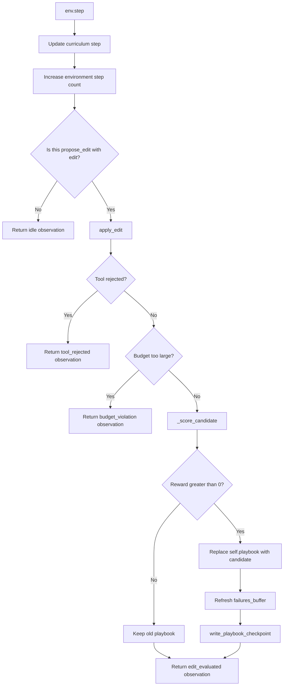

Detailed steps:

1. If `training_step` is passed, it updates the curriculum.
2. It increases `_step_count`.
3. If the action is not a playbook edit, it returns an idle observation.
4. It calls `apply_edit` to create a candidate playbook.
5. If a tool is unsafe, it returns `phase="tool_rejected"`.
6. If the candidate breaks a budget, it returns `phase="budget_violation"`.
7. It calls `_score_candidate`.
8. If reward is positive:
   - `self.playbook = candidate`
   - `self.val_baseline = new_val`
   - `self.failures_buffer = self._collect_failures(n=10)`
   - `write_playbook_checkpoint(self.playbook, components)`
9. It returns `ForgeObservation(phase="edit_evaluated", ...)`.

The key point:

`preview_propose` tests an edit without saving it.

`step` tests an edit and saves it only if reward is positive.

## 19. How checkpoints are saved

When `env.step` accepts an edit, it calls:

```python
write_playbook_checkpoint(self.playbook, components)
```

Open `forge_env/server/persistence.py`.

That function writes a folder under:

```text
outputs/playbook_versions/
```

Each accepted playbook version gets its own folder, for example:

```text
outputs/playbook_versions/v1/
outputs/playbook_versions/v2/
```

The checkpoint contains the playbook snapshot and reward details. The demo reads these folders.

## 20. How metrics are written

Back in `training/train_forge.py`, after each step, the code builds:

```python
row = {
    ...
}
```

This row includes:

- training step
- reward
- validation score
- holdout score
- score by task level
- playbook token count
- whether an edit was accepted
- reward parts
- playbook version
- curriculum phase

At the end:

```python
log_path = out_dir / "smoke_metrics.jsonl"
```

Then it writes one row per line to:

```text
outputs/smoke_metrics.jsonl
```

That file is used by plots and the demo.

## 21. How plots are created

Open `outputs/plots/generate_plots.py`.

This file reads:

```text
outputs/smoke_metrics.jsonl
```

Then it writes images under:

```text
outputs/plots/
```

The plots show things like:

- validation score
- holdout score
- reward
- playbook size
- accepted edits

## 22. How the demo works

Open `demo/app.py`.

The demo is a Gradio app. It reads files that training already wrote.

Flow:

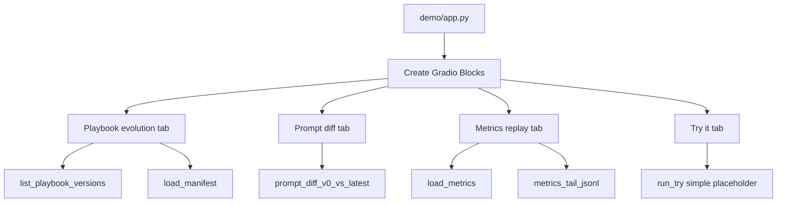

Important functions:

### `evolution_tree_text`

Reads playbook version folders and prints a simple list.

It uses:

```python
list_playbook_versions()
```

from `demo/components/playbook_browser.py`.

### `manifest_view`

Loads a checkpoint manifest for a version like `v3`.

It uses:

```python
load_manifest(v)
```

### `replay_text`

Reads recent metric rows from:

```text
outputs/smoke_metrics.jsonl
```

Then it formats the last few rows for the screen.

### `run_try`

This is still a simple placeholder.

It does not run the real model from the demo button yet. It only echoes the task and points back to this doc.

## 23. How the server path works

Training uses the environment directly in Python.

There is also a server path.

Open `forge_env/server/app.py`.

It creates an OpenEnv web app:

```python
app = create_fastapi_app(forge_env_factory, ForgeAction, ForgeObservation)
```

Flow:

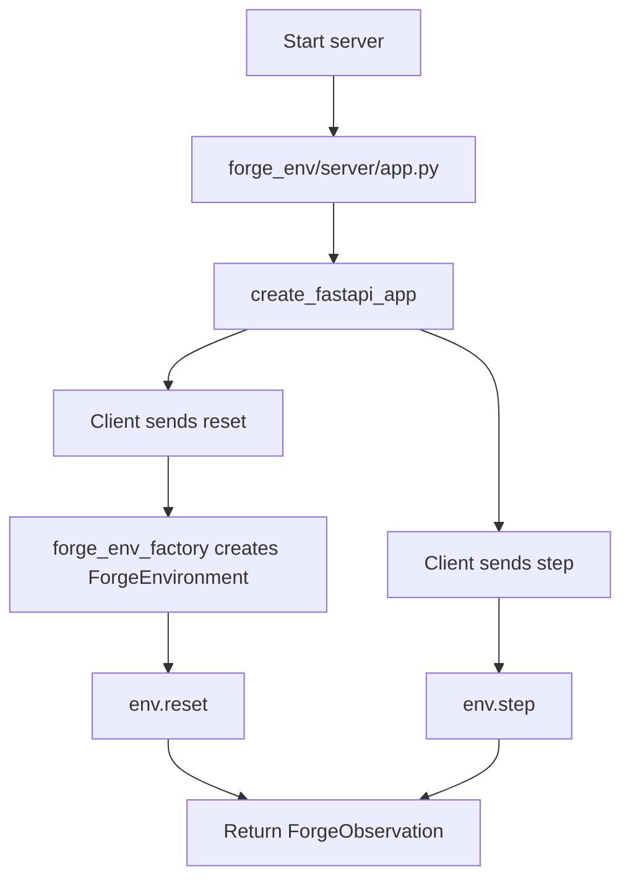

The important point:

The server path and training path both use the same `ForgeEnvironment`. So the core logic stays in one place.

## 24. Data objects used in the flow

Open `forge_env/models.py`.

### `ForgeAction`

This is what a caller sends into `env.step`.

Important fields:

- `type`: tells the environment what kind of action this is
- `edit`: the playbook edit dictionary
- `task_id`: optional task id

In training, the main action is:

```python
ForgeAction(type="propose_edit", edit=...)
```

### `ForgeObservation`

This is what the environment returns.

Important fields:

- `phase`: tells you what happened
- `playbook_snapshot`: current playbook data
- `val_baseline`: current validation score
- `val_after_edit`: validation score after the edit was tested
- `reward_components`: reward details
- `failures_buffer`: failed examples

### `ForgeState`

This is a current state summary.

It includes:

- playbook version
- edit log
- validation accuracy
- playbook size
- curriculum step
- curriculum phase

## 25. Best order to read the code

If you are new to the project, read in this order:

1. `training/train_forge.py`
   - Start at the bottom.
   - Then read `run_training`.
   - Then read `policy_candidate_edits`.

2. `training/editor_policy.py`
   - Read `stub_candidate_edits`.
   - Read `llm_candidate_edits`.

3. `forge_env/server/forge_environment.py`
   - Read `__init__`.
   - Read `reset`.
   - Read `preview_propose`.
   - Read `_score_candidate`.
   - Read `_evaluate`.
   - Read `step`.

4. `forge_env/server/playbook.py`
   - Read `Playbook`.
   - Read `load_initial_playbook`.

5. `forge_env/server/tasks/splits.py`
   - Read `build_task_splits`.

6. `forge_env/server/llm.py`
   - Read `get_configured_llm_client`.
   - Read `TransformersLLMClient`.
   - Read `HuggingFaceApiLLMClient`.
   - Read `extract_json_object`.

7. `forge_env/server/executor.py`
   - Read `run`.
   - Read `_run_llm_agent`.
   - Read `_initial_messages`.
   - Read `_normalize_final`.
   - Then read `_run_stub` and `_finalize_t1`, `_finalize_t2`, `_finalize_t3`.

8. `forge_env/server/tool_runtime.py`
   - Read `available_tools`.
   - Read `run_tool`.

9. `forge_env/server/edit_ops.py`
   - Read `apply_edit`.
   - Read `_validate_template_tool`.

10. `forge_env/server/rewards/compose.py`
   - Read `compute_reward`.

11. `forge_env/server/tasks/tier2_rubric.py`
   - Read `grade_tier2_ensemble`.
   - Read `LLMRubricJudge` if you want model-based grading.

12. `forge_env/server/sandbox/subprocess_runner.py`
   - Read `run_tool_source`.

13. `forge_env/server/sandbox/docker_runner.py`
   - Read `run_tool_source_docker`.

14. `demo/app.py`
   - Read the button functions first.
   - Then read the Gradio layout.

15. `docs/REAL_LLM_AND_COLAB.md`
   - Read this when you want to run Qwen on Colab or use Hugging Face credits.

## 26. One full example flow

Here is one complete run in plain English.

1. You run `python training/train_forge.py --smoke`.
2. Python enters `training/train_forge.py`.
3. `parse_args` reads `--smoke`, model backend, and model name flags.
4. `run_training` starts.
5. `run_training` writes `FORGE_LLM_BACKEND` and `FORGE_LLM_MODEL` into the process environment.
6. `run_training` creates `ForgeEnvironment`.
7. `ForgeEnvironment.__init__` loads the starting playbook.
8. `load_initial_playbook` reads prompts, lessons, routing, and tools from `forge_env/playbook`.
9. `build_task_splits` creates train, validation, and holdout tasks.
10. `ForgeEnvironment.__init__` creates `Executor`.
11. `Executor.__init__` calls `get_configured_llm_client`.
12. If backend is `stub`, the executor stores no model client.
13. If backend is `transformers` or `hf_api`, the executor stores a real model client.
14. `ForgeEnvironment.__init__` calls `_evaluate` to get the starting validation score.
15. `run_training` calls `env.reset(training_step=0)`.
16. `reset` reloads a clean playbook and collects failing examples.
17. The training loop starts at step 0.
18. `set_curriculum_step(0)` makes only `T1` tasks active.
19. `policy_candidate_edits` creates a few possible edits.
20. In `stub` mode, it calls `stub_candidate_edits`.
21. In real model mode, it calls `llm_candidate_edits`, which asks the model for JSON edits.
22. For each edit, `preview_propose` tests it.
23. `preview_propose` calls `apply_edit`.
24. `apply_edit` returns a copied playbook with the edit applied.
25. `preview_propose` checks playbook budgets.
26. `_score_candidate` evaluates the copied playbook.
27. `_evaluate` loops over validation tasks.
28. For each task, `_predict` calls `Executor.run`.
29. In `stub` mode, `Executor.run` calls `_run_stub`.
30. In real model mode, `Executor.run` calls `_run_llm_agent`.
31. `_run_llm_agent` sends the task, playbook, lessons, and available tools to the model.
32. If the model asks for a tool, `ToolRuntime.run_tool` runs it through the sandbox.
33. The tool result is sent back to the model.
34. This repeats until the model returns a final answer or the step limit is reached.
35. `_grade` scores the answer.
36. For `T2`, `FORGE_LLM_JUDGE=1` can make the model grade the written answer.
37. `_evaluate` returns the average score.
38. `_regression_delta` checks if old tasks got worse.
39. `compute_reward` creates one reward number.
40. `preview_propose` returns reward details.
41. `run_training` picks the best candidate edit.
42. If best reward is positive, `run_training` calls `env.step`.
43. `env.step` applies and scores the edit again.
44. If reward is still positive, `env.step` updates `self.playbook`.
45. `env.step` calls `write_playbook_checkpoint`.
46. A new folder is written under `outputs/playbook_versions`.
47. `run_training` writes one metrics row in memory.
48. The loop continues for the next step.
49. At the end, `run_training` writes `outputs/smoke_metrics.jsonl`.
50. Plot code can turn metrics into images.
51. Demo code can show versions, manifests, diffs, and metrics.

## 27. What is not built yet

These are future nice-to-have items:

- A trained editor model instead of direct prompt calls for playbook edits.
- A polished production executor loop with streaming, retries, and better tool descriptions.
- More open-ended learned tools instead of only safe templates.
- Richer web demo and hosted demo publishing.
- More detailed charts for why each edit helped or hurt.

The current project has the local training loop, real model executor mode, real model editor mode, optional model judge mode, tool safety checks, metrics, plots, Colab guide, Hugging Face guide, and demo reading flow.
