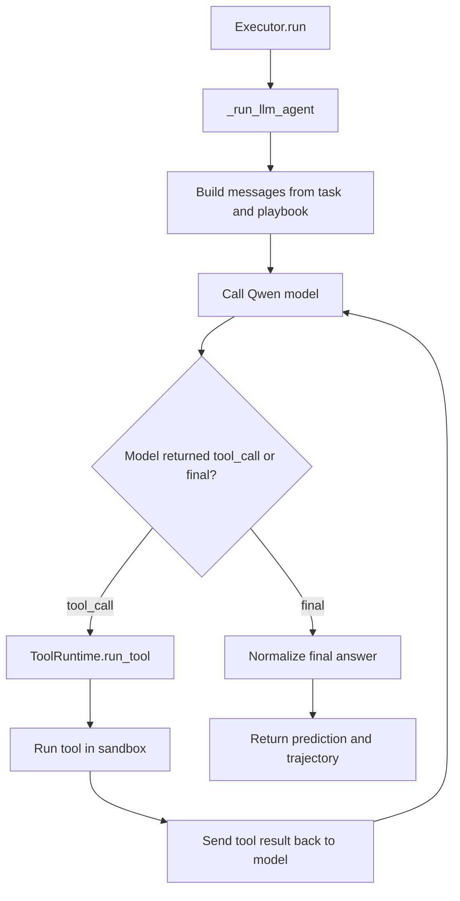

# Real model, Colab, and Hugging Face run guide

This guide explains how the real model path works and how to run it on a T4 Colab.

## 1. What changed

The old local path used a fake executor. It had a loop, but it did not call a model.

Now there are two modes:

| Mode | What happens |
| --- | --- |
| `stub` | Uses simple local placeholder code. Good for tests and quick local checks. |
| `transformers` | Loads a Hugging Face model in Python and uses it for editor and executor calls. Good for Colab T4. |
| `hf_api` | Calls Hugging Face Inference API with `HF_TOKEN`. Good when you want Hugging Face hosted inference. |

Default is still `stub` so local tests do not download a model.

## 2. Where real model calls happen

### Executor model calls

File:

```text
forge_env/server/executor.py
```

Main function:

```python
Executor.run(task, playbook)
```

When `FORGE_LLM_BACKEND=transformers` or `FORGE_LLM_BACKEND=hf_api`, the flow is:



The model must return JSON.

For a tool call:

```json
{
  "thought": "I need the calendar result first.",
  "tool_call": {
    "name": "search_calendar",
    "args": {
      "participants": ["Asha", "Ben"],
      "duration_minutes": 30
    }
  }
}
```

For a final answer:

```json
{
  "thought": "I have enough information.",
  "final": {
    "text": "Here is the final answer."
  }
}
```

### Editor model calls

File:

```text
training/editor_policy.py
```

Main function:

```python
llm_candidate_edits(...)
```

When real model mode is on, the editor model sees:

- current playbook snapshot
- recent failures
- current validation score
- allowed edit types

Then it returns candidate edits like:

```json
{
  "candidates": [
    {
      "diagnosis": "The playbook needs stronger scheduling guidance.",
      "action": {
        "type": "write_lesson",
        "target": "lessons/per_domain/scheduling.md",
        "content": "Always choose the earliest slot that satisfies all participants and duration.",
        "rationale": "Fix scheduling failures."
      }
    }
  ]
}
```

Those edits still pass through:

```text
forge_env/server/editor_schema.py
```

So bad JSON or bad action shapes are turned into safe no-change edits.

### Tool calls

File:

```text
forge_env/server/tool_runtime.py
```

The executor can call built-in tools from:

```text
forge_env/playbook/tools/builtin/
```

It can also call learned tools that were added to the playbook.

All tools run through:

```text
forge_env/server/sandbox/subprocess_runner.py
```

That means tool code is not called directly inside the model loop.

### Written task judge calls

File:

```text
forge_env/server/tasks/tier2_rubric.py
```

By default, written tasks use fast local rubric checks. If you set:

```bash
export FORGE_LLM_JUDGE=1
```

then `grade_tier2_ensemble` uses `LLMRubricJudge`. That sends the response and rubric to the model and asks for a JSON score from 0 to 1.

Keep this off for quick runs. Turn it on when you want the written task score to come from the model too.

## 3. Colab step-by-step

Use a GPU runtime:

```text
Runtime -> Change runtime type -> T4 GPU
```

### Cell 1: Check GPU

```python
!nvidia-smi
```

### Cell 2: Clone your repo

Replace the URL with your repo URL.

```python
!git clone https://huggingface.co/spaces/YOUR_NAME/YOUR_SPACE_NAME META-RL || git clone https://github.com/YOUR_NAME/META-RL.git
%cd META-RL
```

If you uploaded this repo as a zip, mount Drive or upload it, then:

```python
%cd /content/META-RL
```

### Cell 3: Install packages

```python
!pip install -U pip
!pip install -e ".[train,dev]"
!pip install -U torch --index-url https://download.pytorch.org/whl/cu121
```

### Cell 4: Log in to Hugging Face

Use this if you need gated models or want to push results.

```python
from huggingface_hub import login
login()
```

### Cell 5: Choose Qwen model

For T4, start smaller first:

```python
import os

os.environ["FORGE_LLM_BACKEND"] = "transformers"
os.environ["FORGE_LLM_MODEL"] = "Qwen/Qwen2.5-1.5B-Instruct"
os.environ["FORGE_LLM_LOAD_IN_4BIT"] = "0"
os.environ["FORGE_TOOL_ISOLATION"] = "subprocess"
os.environ["FORGE_LLM_JUDGE"] = "0"
```

If you want to try a larger Qwen model on T4, use 4-bit:

```python
import os

os.environ["FORGE_LLM_BACKEND"] = "transformers"
os.environ["FORGE_LLM_MODEL"] = "Qwen/Qwen2.5-7B-Instruct"
os.environ["FORGE_LLM_LOAD_IN_4BIT"] = "1"
os.environ["FORGE_TOOL_ISOLATION"] = "subprocess"
os.environ["FORGE_LLM_JUDGE"] = "0"
```

### Cell 6: Run a tiny real model experiment

This uses the real model for both:

- editor edits
- executor task answers and tool calls

```python
!python training/train_forge.py \
  --llm_backend transformers \
  --model_name "$FORGE_LLM_MODEL" \
  --max_steps 3
```

Increase steps after the small run works:

```python
!python training/train_forge.py \
  --llm_backend transformers \
  --model_name "$FORGE_LLM_MODEL" \
  --max_steps 25
```

### Cell 7: Generate plots

```python
!python outputs/plots/generate_plots.py
```

### Cell 8: Download outputs

```python
from google.colab import files
!zip -r forge_outputs.zip outputs
files.download("forge_outputs.zip")
```

### Cell 9: Push experiment outputs to Hugging Face

Create a dataset repo once on Hugging Face, then run:

```python
from huggingface_hub import HfApi, upload_folder

api = HfApi()
repo_id = "YOUR_NAME/forge-experiment-outputs"
api.create_repo(repo_id=repo_id, repo_type="dataset", exist_ok=True)

upload_folder(
    repo_id=repo_id,
    repo_type="dataset",
    folder_path="outputs",
    path_in_repo="outputs",
)
```

## 4. Hugging Face Space steps

### Option A: Push the demo as a Space

1. Create a new Hugging Face Space.
2. Choose `Gradio`.
3. Upload this repo.
4. Set the Space start command to:

```bash
python demo/app.py
```

5. Add any needed secrets:

```text
HF_TOKEN
FORGE_LLM_BACKEND
FORGE_LLM_MODEL
FORGE_LLM_LOAD_IN_4BIT
FORGE_TOOL_ISOLATION
```

For the demo only, `FORGE_LLM_BACKEND=stub` is fine because the demo mostly reads saved outputs.

### Option B: Push the environment server as a Space

Use the Dockerfile path:

```text
forge_env/server/Dockerfile
```

The server command is:

```bash
uvicorn forge_env.server.app:app --host 0.0.0.0 --port 8000
```

Then clients can connect to the server and call environment `reset` and `step`.

## 5. Hugging Face API mode

If you want Hugging Face hosted inference instead of loading the model on Colab:

```bash
export HF_TOKEN=your_token
export FORGE_LLM_BACKEND=hf_api
export FORGE_LLM_MODEL=Qwen/Qwen2.5-7B-Instruct
python training/train_forge.py --llm_backend hf_api --model_name Qwen/Qwen2.5-7B-Instruct --max_steps 10
```

This spends Hugging Face inference credits instead of using local GPU memory.

## 6. Important notes

- Real model mode will be much slower than stub mode.
- The executor now has a real agent loop, but model quality depends on the model size and prompt following.
- T4 may run out of memory with larger models unless `FORGE_LLM_LOAD_IN_4BIT=1`.
- Keep `FORGE_TOOL_ISOLATION=subprocess` in Colab unless Docker is available.
- Start with 1 to 3 steps before long experiments.
