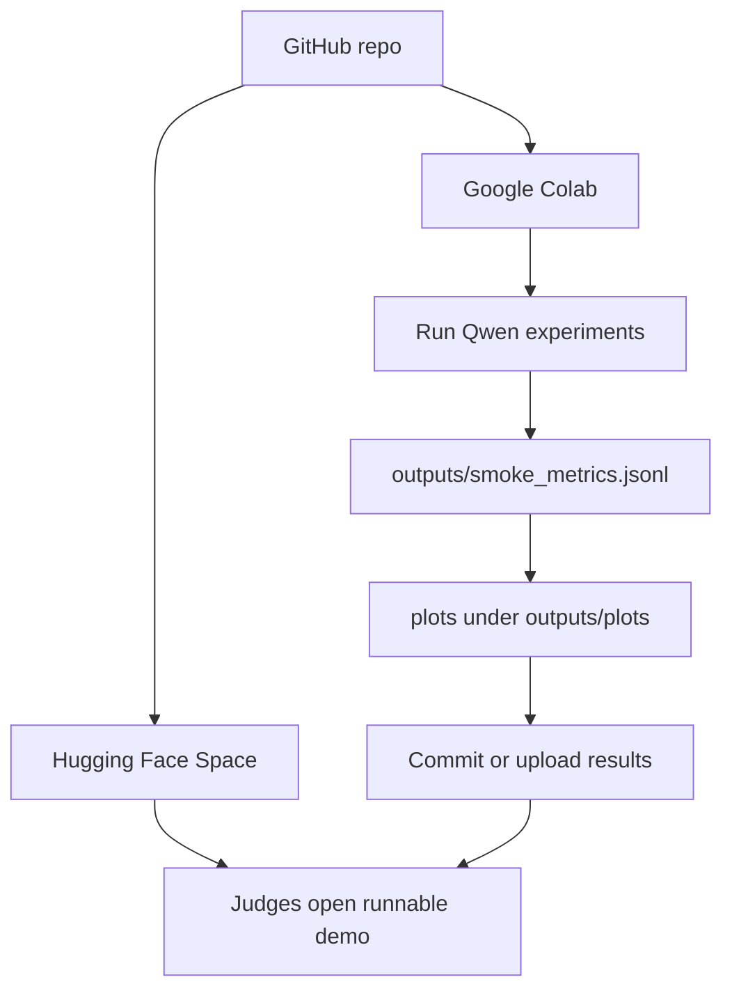

# OpenEnv Hackathon Submission Runbook

This is the checklist to use before final submission.

## 1. What runs where



### Hugging Face Space

The Space is for the runnable demo and environment package.

It should run:

```bash
python app.py
```

That opens the Gradio demo from `demo/app.py`.

**Important:** The Space Docker image runs `pip install -r requirements.txt` **before** it copies your repo into `/app`. So `requirements.txt` must list **only normal PyPI packages**, not `-e .` or `forge-env @ file:///app`. After the copy, `python app.py` runs with working directory `/app`, so `import demo` and `import forge_env` work without a local `pip install`.

### Google Colab

Colab is for experiments because it gives you a T4 GPU.

Use Colab to:

- load Qwen
- run `training/train_forge.py`
- generate plots
- download or upload `outputs/`

### Hugging Face credits

You can spend credits in two ways:

- Use a paid Hugging Face GPU Space to run the demo or experiments.
- Use Hugging Face hosted inference with `FORGE_LLM_BACKEND=hf_api`.

For the hackathon, the simplest path is:

1. Run experiments on Colab T4.
2. Push the demo to a Hugging Face Space.
3. Upload or commit the generated plots.

## 2. Where Unsloth fits

Unsloth is a library that helps fine-tune language models faster and with less GPU memory.

In this repo, the current training loop improves the playbook:

```text
model proposes edits -> environment scores edits -> best edit updates playbook
```

That is already a reinforcement-learning-style loop over playbook edits.

Unsloth would be used in a later stronger version where you fine-tune the editor model weights directly. In that version:

1. Qwen writes candidate edits.
2. Forge scores those edits.
3. The reward is used to train Qwen to write better edits next time.
4. Unsloth makes that fine-tuning cheaper on a T4.

The current code has `training/unsloth_setup.py` as the integration point. It detects Unsloth when installed, but the current run does not yet update model weights with Unsloth. Be transparent about this in the pitch: this submission trains the playbook, not the Qwen weights.

## 3. Create the Hugging Face Space

Install the Hugging Face CLI:

```bash
pip install -U huggingface_hub
huggingface-cli login
```

Create a Gradio Space:

```bash
huggingface-cli repo create forge-openenv --type space --space_sdk gradio
```

Add the Space remote:

```bash
git remote add space https://huggingface.co/spaces/YOUR_NAME/forge-openenv
```

Push:

```bash
git push space main
```

If Git says the Space has its own first commit, run:

```bash
git pull space main --allow-unrelated-histories
git push space main
```

Then open:

```text
https://huggingface.co/spaces/YOUR_NAME/forge-openenv
```

## 4. Run experiments in Colab

Use:

```text
notebooks/forge_qwen_colab_steps.py
```

or copy the cells from:

```text
docs/REAL_LLM_AND_COLAB.md
```

The GitHub clone URL is:

```bash
git clone https://github.com/vamsi805/META-RL.git
```

Minimum useful run:

```bash
python training/train_forge.py \
  --llm_backend transformers \
  --model_name Qwen/Qwen2.5-1.5B-Instruct \
  --max_steps 3
```

Better run if time allows:

```bash
python training/train_forge.py \
  --llm_backend transformers \
  --model_name Qwen/Qwen2.5-1.5B-Instruct \
  --max_steps 25
```

Then:

```bash
python outputs/plots/generate_plots.py
```

## 5. What results to show

Commit or upload these:

- `outputs/smoke_metrics.jsonl`
- `outputs/plots/01_val_accuracy.png`
- `outputs/plots/02_holdout_generalisation.png`
- `outputs/plots/03_reward_components_stacked.png`
- `outputs/plots/07_baseline_vs_trained.png`
- `outputs/plots/08_training_loss_proxy.png`

Use these in the README and blog/video:

- validation score over time
- holdout score over time
- reward components
- baseline vs trained
- loss proxy

## 6. Mini-blog or video outline

Keep it under 2 minutes.

1. Problem: agents are brittle because their prompts/tools do not improve from failures.
2. Environment: Forge gives the agent tasks, scores behavior, and rewards useful playbook edits.
3. Agent behavior: the model proposes edits, the executor solves tasks with tools, and the environment accepts only edits that improve validation reward.
4. Results: show reward and validation plots.
5. Why it matters: this is a small environment for studying self-improving agents and prompt/tool learning.

## 7. Final README links to fill

Before submitting, update `README.md` with:

- Hugging Face Space URL
- blog or video URL
- Colab notebook link
- final plot images from your real run
